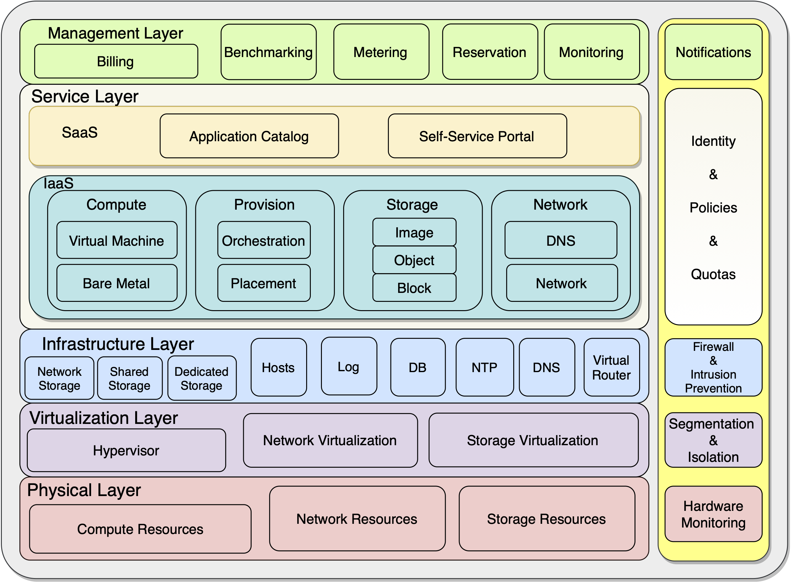

# Academic Cloud

The Academic Cloud Architecture describes the concept of a cloud computing system which can be implemented in academic institutions to provide services for education and research.

<p align="center" href="docs/architecture.png"></p>


This proof of concept provisions an infrastructure example using OpenStack with the following components: 

- Glance
- Nova
- Keystone
- Placement
- Neutron
- Cinder
- Heat
- Horizon

### Experiment

Any data collected during the experiment is provided in the `experiment` directory. For the host setup, see the documented [testbed](docs/testbed.md).

### Contact

- Author: Felipe Pfeifer Rubin
- Advisor: Tiago C. Ferreto

We had a whole lot of problems when developing this Proof-of-Concept and the worst of them (those that took more than just googling around) are described in our [KB](docs/kb.md).

Feel free to contact us at: felipe.rubin@edu.pucrs.br

### Validating Configurations

Validate Vagrant Syntax, which includes hosts.yaml.
```sh
vagrant validate
```

Run only Vagrant to check for enough resources.
```sh
vagrant up ; sleep 5 ; vagrant destroy -f
```

Validate Ansible Playbook Syntax
```sh
ansible-playbook playbook.yml --syntax-check
```

Check if all your hosts are accessible
```sh
ansible -i experiments/inventory.ini all -m  ping
```

## Provisioners

This section describes the tooling developed to provision the architecture Proof-of-Concept on both Type-1 and Type-2 Hypervisors.

#### Type 1 (KVM)

Inside the experiments directory there are files describing how to properly configure the host. Albeit nested virtualization is used, configuring a physical host is another story. Therefore, we don't provide any automation script for such, since configuring the network aspect that the in turn the virtual machines will be using and routing in regard to one's own infrastructure would not be feasible.

A simple script is provided for creating the virtual environment. Edit the hosts file `inventory.ini` to fit your needs. Further information is provided as comments in that file.

**Provisioning**
```sh
cd architecture
chmod +x makevms.sh
./makevms.sh -a
# Wait for all VMs to Answer
ansible -i experiments/inventory.ini all -m  ping
# Provision the Cloud
ansible-playbook playbook.yml -i experiments/inventory.ini -vvvv
```

**Destroying**
```sh
cd architecture
./makevms.sh -dd
```

#### Type 2 (Parallels Desktop, VirtualBox, VMware Fusion)

A hosts.yml file defines all the hosts that will be provisioned. You may change the configurations however you like, but beware that the controller node runs a mysql db (mariadb) and if low on resources (e.g., 4GB of RAM only) the database will crash during its setup.

The provisioner script runs both vagrant and then ansible. The vagrant provider is selected by your environment variables, if none is set it will use virtualbox. In addition you may use the flag `--provider` to allow the script to export the environment variable. At the end of its execution the elapsed time is displayed. If running over an SSD it should take about 35 minutes on modern laptops.

**Provisioning**
```sh
chmod +x provision.sh
./provision.sh # Normal Provisioning
./provision.sh --with-scenarios # Same as above, but provisions a Jupyter Notebook Server at the end.
```

**Destroying**
```sh
./provision.sh --clean-only
```

## Environment

The following describes some of the configurations that are done by ansible.

### Components

There are 5 Virtual Machines that are deployed by default. According to our Ansible provisioning playbook we separate them in two groups:

**Core**

The following must be provisioned, one way or another. The playbook is only successfull if it can provision all of them; hence they cannot be changed without modifying the playbook.yml by hand.

- Gateway

	> Provides access to the Environment from the outside, with built-in NAT capabilities between its interfaces (Provider Network and Public Network), allowing network administrators to easily add a route to its environment for public access. Also provides data visualization (Grafana) and aggregation (Prometheus and Loki).

- Controller

	> The "Brain", control services, databases, credentials, APIs, and others.

- Storage

	> A virtual machine with at least a second disk (virtual or physical) dedicated for Cinder with LVM (Linux Virtual Volumes), providing Compute Nodes with volumes for their machines.


**Compute**

> Nested Virtualization Hosts using KVM.


### Services Available


**Monitoring**

The Gateway provides monitoring for the infrastructure using Grafana, Prometheus, Loki, Collectd, and Promtail. The service is accessible at the gateway IP and port `3000`.

**API**

Ansible, during Keystone configuration, creates a file at `credentials/adminrc` that can be used alongside the package `python-openstackclient` for interacting with the environment.

**Dashboard**

Horizon is accessible through the gateway, using the address "http://<horizon-ip>/horizon".

**Credentials**

This is not a production environment, far from it; it is a Proof-of-Concept. All services are accessible using these purposedly simple and insecure credentials:

- Username: admin
- Password: admin

## Accessing the Environment


During Ansible's Provisioning the Gateway Public IP is printed out.
Example:

> Gateway Public IP: 192.168.15.181

The following describes some of the alternatives for accessing this environment.


### Adding Routes

In this section we describe how to access your environment by adding routes to your internal environment. The last possibility is using a Poorman's VPN.

#### Using IP (Linux)

The following commands were tested on Ubuntu 18.04LTS. 

**List all routes**
```sh
ip route show
```

**Add a Route to the Gateway**
```sh
sudo ip route add <Provider Subnet> via <Gateway Public IP>
# Example: sudo ip route add -net 10.0.1.0/24 via gateway.local
```

**Delete the Route**
```sh
sudo ip route delete <Provider Subnet>
# Example: sudo ip route delete 10.0.1.0/24
```

#### Using BSD netstat

The following commands were tested on MacOS Catalina 10.15

**List all routes**
```sh
netstat -nr
# For IPv4: -f inet 
# For 
```

**Add a Route to the Gateway**
```sh
sudo route -n add -net <Provider Subnet> <Gateway Public IP>
# Example: sudo route -n add -net 10.0.1.0/24 gateway.local
```

**Delete the Route**
```sh
sudo route delete -net <Provider Subnet>
# Example: sudo route delete -net 10.0.1.0/24 192.168.15.177
```

### SOCKS5 Proxy (Poor Man's VPN)

If you have access to the physical server, but not to its network, adding routes from your remote workstation might not work. This may be due to many things, but its usally firewalls. The alternative is either to use a VPN such as OpenVPN and push specific routes through it (talk to your network administrator), or use a "Poor Man's VPN". The latter tunnels all your traffic through an SSH connection.

Create the tunnel and leave it running in the background
```sh
ssh -D 8123 -f -C -q -N user@<bastion-host>
```

Delete the tunnel (will stop all ssh connections)
```sh
sudo killall ssh
```


